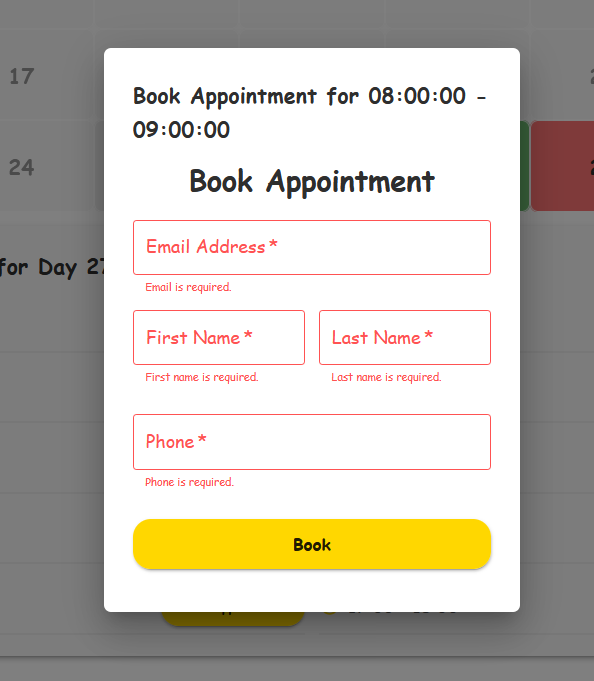

# Beti Dental Web App — Preview & Feature Demos

This folder contains visual previews (GIFs and images) that demonstrate how the Beti Dental web application functions.

---

### 🏠 Homepage

Demonstrates the general layout and design of the site.

---

### 📆 User Base Calendar

The default **User Calendar** view showing available and unavailable days for booking.

| Color               | Meaning                               |
|---------------------|---------------------------------------|
| 🕸️ **Gray (full)** | Past day (already passed)             |
| ⚪ **Gray (light)**  | Day not yet made available by dentist |
| 🟩 **Green**        | Available day for appointments        |
| 🟥 **Red**          | Dentist's non-working day             |

---

### 🕒 Booking Slots

Displays available time slots on a working day.

- Booked hours are grayed out and not clickable.

---

### 📝 Booking Modal Form

Shows the **Booking Modal** form.

**Required Fields:**

- First Name
- Last Name
- Email
- Phone Number

Ensures all information is filled in before a booking is submitted.

---

### 📅 Admin Appointments section

Shows the **Dentist appointments**

Each appointment shows:
- User's first and last name
- User's email
- User's phone
- User's requested date
- User's requested hour slot
- When the request has been created
- Status of the request
- Reason if appointment has been canceled

### 📅 Bookings Flow

Full booking flow including both user and admin interactions:

1. User selects a day → chooses an hour.
2. User enters details and requests an appointment.
3. Admin sees the booking request in their panel and confirms it.
4. The booked slot becomes unavailable for others.
5. Admin cancels the booking with a reason.
6. The slot becomes available again for the user.

This demonstrates:

- Real-time booking validation
- Admin approval workflow
- Booking cancellation with feedback

---

### 🗓️ Admin Schedule Panel

Displays the **Admin Schedule Calendar**.

- Toggle days between working/non-working
- Apply custom working hour presets
- Add 30-min or 1-hour time slots dynamically
- Define custom time slots manually
- Toggling off a day disables all time slots

---

### 🦷 Schedule Management

Showcases dentist scheduling and availability:

1. A day is initially unavailable in the user calendar.
2. Admin opens the **Schedule Panel**, toggles the day to "working."
3. Applies working hours using presets.
4. User calendar reflects the updated availability for that day.

This demonstrates:

- Schedule management
- Admin presets and calendar integration
- Real-time availability updates

## 👥 Admin User Management

### 📋 User List & Actions

Shows the **Admin Users Panel** with:

- A table of all available users
- Edit and Delete actions for managing user accounts

---

### ➕ Create User Modal

Displays the form used by admins to create new users.

- Validation to ensure all required fields are completed

